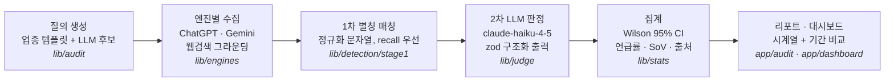
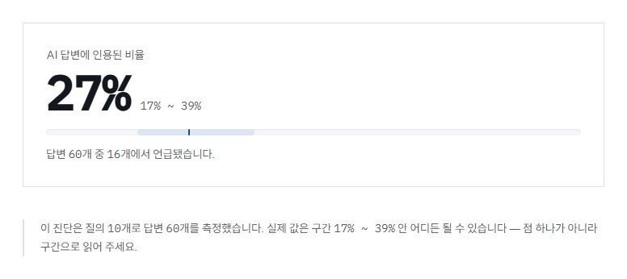
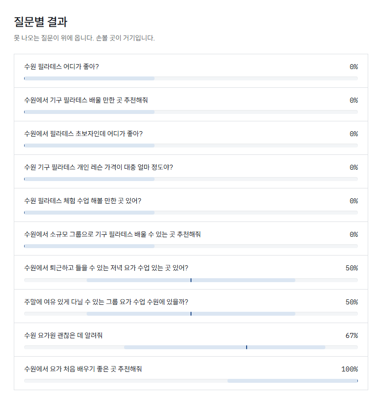
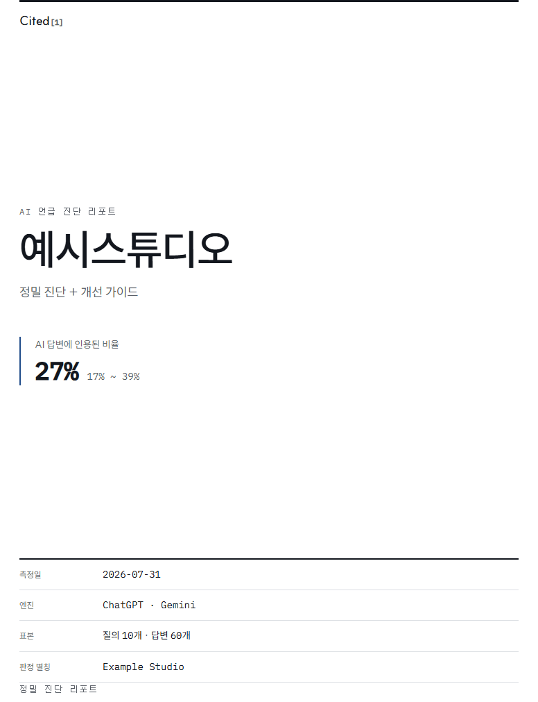

# Cited

**다중 LLM 답변에서 브랜드 언급을 측정하는 평가 파이프라인.**
ChatGPT·Gemini에 같은 질의를 반복해 던지고, 답변 속 브랜드 언급을 2단계로
판정하고, 신뢰구간과 함께 시계열로 기록한다. 응용 도메인은 한국어
GEO(Generative Engine Optimization) 모니터링 — [cited.co.kr](https://cited.co.kr)에서
운영 중이다.

핵심 문제는 셋이고, 전부 LLM 평가의 일반 문제다:

1. **비결정적 출력의 측정** — 같은 질문에 답이 매번 다르다. 점추정 하나는
   거짓말이므로 표본을 여러 개 뽑아 Wilson 신뢰구간으로 보고한다.
2. **판정 자체의 신뢰성** — "언급됐는가"를 LLM이 판정한다면 그 판정기를 누가
   검증하는가. 골드 라벨 회귀 게이트가 한다(아래 숫자).
3. **원가 통제** — 모든 답변을 LLM에 넣으면 원가가 측정을 잡아먹는다.
   싼 1차(문자열)가 70~80%를 거르고, 비싼 2차(LLM)는 통과분만 본다.

## 아키텍처



- **1차(`detection/stage1`)** 는 별칭·정규화 기반 문자열 매칭이다. 임무는
  "여기 뭔가 있을 수 있다"까지 — recall을 깎는 판단은 하지 않는다. 1차에서
  놓친 것은 영원히 복구되지 않지만, 2차로 넘긴 것은 비용만 더 들고 결과는 옳다.
- **2차(`judge/claude.ts`)** 는 동음이의어 여부(isBrandReference), 언급 순서
  (position), 감성, 맥락 요약을 배치(20건)로 판정한다. `messages.parse` +
  zod 스키마라 파싱 실패·잘림(`max_tokens`)·거부가 전부 구분되는 에러다.
- **판정 실패는 데이터 손실이 아니다.** 원문(`answers.raw`)을 절대 버리지
  않으므로 미판정(unresolved)으로 남기고 나중에 재판정한다. 수집과 판정을
  분리한 배당금이다.
- `detection/`·`stats/`는 **순수 함수 경계**다. 외부 I/O를 import하면 lint가
  막는다(`eslint.config.mjs` allow-list). 판정기(`JudgeFn`)는 주입받는다 —
  그래서 회귀·통합 테스트가 API 키 없이 돈다.

## 측정 품질 — 숫자부터

| 항목 | 값 | 근거 |
| --- | --- | --- |
| 골드 라벨 | **248건** (긍정 108 · 부정 140) | `tests/golden/labels.json`, 실제 수집 답변에서 수작업 라벨링 — [데이터셋 문서](docs/golden-labels.md) |
| 실측 정확도 | **recall 99.1% · precision 100.0%** (2026-08-20) | 게이트 기준 recall ≥ 95% · precision ≥ 90% (`tests/golden/regression.test.ts`) |
| 판정 모델 | `claude-haiku-4-5` | sonnet·gpt-5-mini와 **전 건 동일 판정** — 최저 지연 + 측정 대상 엔진과 제공사 분리로 선택 ([모델 비교](docs/judge-model-comparison.md)) |
| 표본 수 | 무료 1회 · 유료 3회 (LLM 엔진당) | 비결정 출력이므로 표본 n이 구간 폭을 결정 — 아래 "측정 예산 정책" |
| 보고 형식 | Wilson 95% 신뢰구간 | 점추정 단독 노출 금지 — 3회 측정 1건 언급의 구간은 2%~87%다 |

게이트는 **조용히 건너뛰지 않는다.** 라벨 파일이 없거나 API 키가 없으면
스킵이 아니라 실패다 — 게이트가 꺼진 채 초록불이 뜨는 것이 게이트가 없는
것보다 나쁘다(없으면 없는 줄 알지만, 꺼져 있으면 지켜지고 있다고 믿는다).

판정과 별개로 **표시 층에도 정직성 불변식**이 있다: 구간이 겹치면 "변화
없음"으로 판정하고, 측정 조건이 다른 회차는 비교하지 않으며(선을 끊고 이유를
적는다), 미측정은 0%가 아니라 "측정 없음"이다. 곡선 보간·카운트업처럼 재지
않은 값을 만들어내는 연출은 쓰지 않는다.

그 불변식이 화면에서 어떻게 생겼는지가 이것이다. 점추정 `27%`를 크게 쓰되
**구간 `17% ~ 39%`를 같은 줄에 붙여** 놓고, 분모(`답변 60개 중 16개`)를 밝히고,
마지막 줄에서 읽는 법을 직접 말한다 — *"점 하나가 아니라 구간으로 읽어 주세요."*

<p align="center">
  
</p>

질문별로도 같은 규칙이다. 각 줄의 옅은 띠가 구간이고 짙은 눈금이 점추정이다.
정렬은 **못 나오는 질문이 위로** 온다 — 손볼 곳이 거기이기 때문이다.

<p align="center">
  
</p>

리포트 표지에는 **측정 조건을 같이 박는다**(측정일·엔진·표본 크기·판정 별칭).
조건이 다른 회차를 나중에 나란히 놓고 비교하는 사고를 막는 장치다.

<p align="center">
  
</p>

## 프롬프트는 코드다

판정 프롬프트를 바꾸면 **측정값 자체가 바뀐다** — 지난 회차와의 비교
가능성이 깨진다. 그래서 프롬프트는 코드와 같은 게이트를 통과해야 한다.

실측으로 배운 것들이 주석으로 박제되어 있다(`src/lib/judge/claude.ts`):

- "몇 번째로 언급된 브랜드인가, 1부터 센다"를 명시하지 않으면 position이
  **문자 오프셋**(18 같은 값)으로 돌아온다.
- 모델이 "미언급인데 3위"처럼 어긋난 답을 줄 수 있으므로, 코드가 한 번 더
  정합성을 맞춘다(언급이 아니면 position은 null).
- 수집 쪽도 같다: ChatGPT·Gemini 어댑터의 시스템 프롬프트는 **글자 하나까지
  같아야 한다**(`engines/chatgpt.ts`). 다르면 엔진 간 비교가 무의미해진다.
- 수집 모델 선정도 측정 문제다: `gpt-5.4-mini`는 절반 값이지만 답변이 얄팍해
  (276자, 인용 0건) **언급률이 체계적으로 낮게 측정된다.** 원가를 아끼려다
  측정값을 망가뜨리는 선택이라 `gpt-5-mini`를 쓴다 — Gemini와 답변 길이·인용
  밀도가 가장 비슷한 모델이기도 하다(실측 비교표가 주석에 있다).

## 측정 예산 정책 (`src/lib/plans.ts`)

`plans.ts`는 요금표가 아니라 **측정 예산의 단일 출처**다. 플랜이 결정하는
것은 기능이 아니라 통계량이다: 질의 수 × 엔진 × 표본 수 = 표본 크기 = 구간 폭.

- `samples.llm`이 무료 1 · 유료 3인 이유: 비결정 출력에서 표본 수는 곧
  신뢰구간 폭이고, 동시에 곧 원가다(답변 하나가 LLM 호출 하나). 무료 진단은
  "지금 어디쯤인지"의 넓은 구간 한 점, 유료는 변화 판정이 가능한 폭이다.
  요금제 페이지의 카피("측정 횟수가 곧 신뢰구간의 넓이입니다")가 이 상수의
  번역이다.
- 실측 단가가 결정을 끌고 간다: 질의 1개당 월 1,642원(답변당 LLM 38.68원 ·
  SERP 37.45원 기준), Starter·Business 원가율 17%. Business의 질의 한도를
  브랜드별이 아니라 **계정 전체**로 정한 결정도 "질의당 받는 돈" 줄 맞추기로
  주석에 계산이 남아 있다.
- 엔진 단가도 실측이다(`engines/pricing.ts`): Gemini grounding은 호출이 아니라
  **검색 질의 단위**로 청구되고(한 호출이 검색 2건을 돌리면 2건 청구), 검색
  본문 토큰은 Gemini는 청구하지 않지만 OpenAI는 청구한다 — 같은 공식으로
  계산하면 원가가 틀린다.

## 운영 층

측정 코어를 감싸는 SaaS 층. 짧게만:

- **정기 측정** — GitHub Actions cron(`*/10 18-20 * * 0,2,4` UTC = 월·수·금
  KST 새벽)이 `lib/cron/measure.ts`를 두드린다. 호출당 브랜드 1개(실측
  233초, 함수 한도 300초 안), 큐 없는 소진 방식. 잠금·재시도(상한 2회)·죽은
  실행 판정(15분)을 별도 테이블 없이 `collection_runs` 상태로만 한다.
- **인증·할당량** — better-auth + 플랜 게이트(`resolveLimits`). 온보딩에서
  질의를 **동결**해야 측정이 시작된다 — 같은 질의를 반복해야 시계열이 서므로.
- **관측** — `/api/health`(실패 시 예외 내용을 응답에 담지 않는다 — 드라이버
  예외에 접속 문자열이 실려 온다), Sentry(개인정보 스크럽:
  `lib/sentry-scrub.ts`), 구조화 로그.
- **리포트** — 무료 진단은 토큰 URL의 웹 리포트(인쇄 대응), 유료는 대시보드
  (시계열·기간 비교·질문별 히트맵·출처·CSV).
- **결제는 아직 열리지 않았다** — 의도된 상태다. 요금제 페이지가 그 사실을
  그대로 말하고 무료 진단으로 보낸다. 플랜은 수동 부여로 운영한다.

## 문서

| 문서 | 내용 |
| --- | --- |
| [골드 라벨 데이터셋](docs/golden-labels.md) | 정답지 구성·라벨링 기준·실측 recall/precision |
| [판정 모델 비교](docs/judge-model-comparison.md) | 같은 골드셋에서 모델별 정확도·원가·지연 |
| [설계](docs/superpowers/specs/2026-07-28-cited-design.md) | 제품·데이터 모델·판정 로직의 근거 |
| [로드맵](docs/superpowers/plans/2026-07-28-cited-roadmap.md) | 1~6단계 전체 |
| [착수 전 확인](docs/superpowers/notes/2026-07-28-preflight.md) | 확정 버전·도메인 결정 |

## 요구사항

- **Node 24.x** — `package.json`의 `engines`가 `>=24 <25`로 고정돼 있고
  `.npmrc`에 `engine-strict=true`라 다른 메이저에서는 설치가 거부된다.
  `.nvmrc`가 있으므로 `nvm use`로 맞출 수 있다.
- **pnpm 10.34.5** — `packageManager` 필드가 진실의 원천이다.
  `corepack enable`만 해 두면 버전이 자동으로 맞춰진다. 다른 곳(CI 워크플로
  포함)에 버전을 또 적지 않는다 — 적으면 드리프트가 생긴다.
- **Neon Postgres** 프로젝트 하나, **Resend** 계정 하나.
- 측정 코어까지 돌리려면 **OpenAI · Gemini · Anthropic API 키**가 추가로
  필요하다(없어도 앱 자체는 부팅된다 — 아래 참고).

## 로컬 셋업

```bash
pnpm install
cp .env.example .env.local
# .env.local의 아래 3개를 채운다 (자세한 내용은 다음 절)
pnpm db:migrate
pnpm dev
```

### `.env.local`에서 반드시 채워야 하는 값

`.env.example`을 복사한 직후 `pnpm dev`를 돌리면 `src/lib/env.ts`의 부팅 검증이
**빈 값 3개를 이유로 실패한다**(`env.test.ts`의 `.env.example` 테스트가 이 목록을
고정한다). 채워야 하는 것은 이 3개뿐이고, 나머지는 비워 둬도 로컬이 돈다.

| 변수 | 어디서 얻나 |
| --- | --- |
| `DATABASE_URL` | Neon 대시보드 > Connection string (**pooled**) |
| `BETTER_AUTH_SECRET` | `openssl rand -base64 32` (32자 이상이어야 통과) |
| `RESEND_API_KEY` | resend.com > API Keys |

`DATABASE_URL_UNPOOLED`(Neon의 **direct** 연결 문자열)는 비워 둬도 부팅은 되지만
채우는 것을 권장한다 — `pnpm db:migrate`가 이 값을 쓰고, 없으면 pooled 연결로
DDL을 돌리게 되어 문제를 일으킬 수 있다. Neon이 두 문자열을 다 준다.

측정 경로(`OPENAI_API_KEY` · `GEMINI_API_KEY` · `ANTHROPIC_API_KEY`)는 실제
수집·판정을 돌릴 때만 필요하다. 골드 라벨 회귀와 스모크 테스트가 이 키들을
읽는다.

`BETTER_AUTH_URL`과 `NEXT_PUBLIC_APP_URL`은 `.env.example`에 이미
`http://localhost:3000`으로 들어 있다. **두 값은 정확히 같아야 한다** — 다르면
better-auth의 origin 검사가 모든 인증 요청을 거부하므로 부팅 단계에서 막는다.

`EMAIL_FROM`의 예시값(`noreply@example.com`)으로는 실제 발송이 안 된다. Resend는
인증된 도메인에서만 보낸다. 도메인 인증 전에는 `Cited <onboarding@resend.dev>`로
두면 **Resend 가입 계정 주소로만** 메일이 간다 — 로컬 가입 플로우 확인에는 충분하다.

`CRON_SECRET`은 로컬에서 비워 둔다(크론이 돌지 않는다). 배포에서는 필수다 —
[배포](#배포) 참고.

> 비밀 값은 `.env.local`에만 둔다. `.gitignore`가 `.env*`를 전부 무시하고
> `.env.example`만 예외로 둔다. `.env.example`에는 자리표시자만 적는다.

## 명령

| 명령 | 하는 일 |
| --- | --- |
| `pnpm dev` | 개발 서버 (Turbopack) |
| `pnpm build` | 프로덕션 빌드 |
| `pnpm start` | 빌드 결과 실행 |
| `pnpm lint` | ESLint (순수 경계 강제 포함) |
| `pnpm typecheck` | `tsc --noEmit` |
| `pnpm test` | 단위·통합 테스트. **외부 API도 실제 DB도 건드리지 않는다** (`vitest.config.ts`가 더미 환경변수를 주입한다) |
| `pnpm test:watch` | 위를 워치 모드로 |
| `pnpm test:smoke` | `*.smoke.test.ts`만. **실제 DB·외부 API에 붙는다** — `.env.local`의 진짜 자격증명을 읽고, 진짜 메일이 나갈 수 있다. 골드 라벨 회귀도 이 경로다 |
| `pnpm test:e2e` | Playwright E2E (`tests/e2e/` — 무료 진단·온보딩 플로우) |
| `pnpm label:collect` / `pnpm label` | 골드 라벨 후보 수집 · 수작업 라벨링 CLI |
| `pnpm db:generate` | `schema.ts` 변경 → `drizzle/`에 마이그레이션 SQL 생성 |
| `pnpm db:migrate` | 마이그레이션 적용 (direct 연결 사용) |
| `pnpm db:studio` | DB 브라우저 |
| `pnpm db:push` | 스키마를 마이그레이션 없이 밀어넣기. **공유 DB에는 쓰지 않는다** — 커밋된 마이그레이션과 실제 DB가 어긋난다 |

`pnpm db:generate`를 잊으면 CI가 막는다. 스키마 테스트는 메모리상의 drizzle
설정만 읽고 `drizzle/*.sql`은 읽지 않으므로, 테스트가 전부 초록인데 마이그레이션만
낡아 있을 수 있다. CI가 `db:generate`를 다시 돌려 `drizzle/` 트리가 더러워지면
실패시킨다.

## 배포

Vercel의 GitHub 연동으로 자동 배포된다. CI(`.github/workflows/ci.yml`)는 검증만
하고 배포는 수행하지 않는다. 정기 측정은 별도 워크플로
(`.github/workflows/measure.yml`)가 스케줄로 두드린다.

### 환경변수

`.env.example`의 필수 항목을 Vercel Production 환경에 전부 등록한다. 로컬과
다른 점 두 가지:

1. **`BETTER_AUTH_URL`·`NEXT_PUBLIC_APP_URL`은 실제 도메인의 `https://` URL**로,
   서로 **정확히 같게**. 배포 환경에서 `http://`면 부팅이 거부된다. 이 판정은
   세션 쿠키의 `Secure` 플래그와 같은 조건을 쓴다(`src/lib/env.ts`,
   `src/lib/auth.ts`) — 한쪽만 켜지면 세션 토큰이 평문으로 나가기 때문이다.

2. **`CRON_SECRET`은 배포에서 필수다. 없으면 부팅이 실패한다.**
   그렇게 만든 이유: 이 값이 없으면 `/api/cron/*`이 fail-closed로 401만 돌려주고
   만료 세션 정리가 **조용히** 멈춘다 — 그러면 접속 IP·User-Agent가 든 만료
   세션이 계속 쌓여 개인정보처리방침 §3·§4의 "하루 1회 자동 삭제"가 거짓이 된다.
   조용한 실패를 시끄러운 부팅 실패로 바꾼 것이다.
   값은 `openssl rand -base64 32`로 만들어 Vercel 환경변수에만 넣는다(여기 적지 않는다).
   Vercel Cron은 이 변수가 설정돼 있으면 스케줄 호출에
   `Authorization: Bearer $CRON_SECRET` 헤더를 자동으로 붙인다.

### 크론

| 경로 | 스케줄 | 하는 일 |
| --- | --- | --- |
| `/api/cron/measure` | GitHub Actions `*/10 18-20 * * 0,2,4` (UTC = 월·수·금 KST 새벽) | 정기 측정 — 호출당 브랜드 1개 소진 |
| `/api/cron/cleanup-sessions` | Vercel Cron `0 18 * * *` (UTC = 매일 03:00 KST) | 만료된 로그인 세션 일괄 삭제 |

세션 정리는 편의 기능이 아니라 개인정보 보유기간의 집행 경로다. better-auth는
만료 세션을 "그 세션으로 다시 접속할 때" 지우므로, 접속이 없으면 만료 행이
영원히 남는다. 이 크론을 떼면 개인정보처리방침이 거짓이 된다.

### 헬스체크

```
GET /api/health
  200 {"ok":true,"db":"up","latencyMs":12}
  503 {"ok":false,"db":"down"}
```

DB에 `select 1`을 한 번 던진다. **실패해도 예외 내용을 응답에 담지 않는다** —
드라이버 예외에 접속 문자열이 실려 오기 때문이다. 진단은 로그(`health.db.failed`)에서 본다.

배포 후 확인은 `.github/workflows/post-deploy-health.yml`이 자동으로 한다. Vercel이
프로덕션 배포를 끝내고 GitHub에 남기는 `deployment_status`를 트리거로 쓰므로 배포와
경합하지 않는다(이 파일이 기본 브랜치에 있어야 발동한다).

## 아키텍처 원칙

1. **`src/lib/detection/`과 `src/lib/stats/`는 순수 함수다.** 외부 I/O를 import하면
   lint 에러가 난다(`eslint.config.mjs`의 allow-list). 저장된 실제 답변으로 회귀
   테스트를 API 키·DB·네트워크 없이 돌리기 위해서다. 필요한 것은 인자로 주입받는다.
2. **`answers.raw`를 절대 버리지 않는다.** 판정 로직을 개선하면 과거 데이터를 재판정한다.
3. **`collection_runs.planSnapshot`이 없는 수집은 만들지 않는다.** 없으면 시계열 비교가
   무의미해진다.
4. **플랜 설정은 코드 상수(`src/lib/plans.ts`)다.** DB 테이블로 만들지 않는다.
5. **라우트 핸들러에 로직을 두지 않는다.** 본체는 `src/lib/`의 순수 함수로 빼고
   의존성을 주입한다. 라우트 파일은 실제 의존성을 꽂는 얇은 층이다 — 그래야 실제
   DB 없이 테스트가 돈다 (`src/lib/cron/measure.ts`, `src/lib/health/check.ts`).
6. **개인정보를 로그에 넣지 않는다.** `logger.error`의 필드는 그대로 Sentry `extra`로
   간다. 이메일은 마스킹하고(`src/lib/email/send.ts`), 예외는 `message`가 아니라
   `name`만 남긴다.

## 구조

```
src/
  app/
    (marketing)/          랜딩 · 요금제
    (auth)/               sign-in · sign-up · verify-email
    (app)/                dashboard · onboarding · billing · settings (인증 필요)
    audit/                무료 진단 신청 · 토큰 URL 리포트
    legal/                terms · privacy
    api/auth/[...all]/    better-auth 핸들러
    api/cron/             measure · cleanup-sessions (Bearer 인증)
    api/health/           헬스체크
  lib/
    engines/              엔진 어댑터 (chatgpt · gemini) + 실측 단가표
    detection/            1차 별칭 매칭 · 2차 판정 오케스트레이션 (순수)
    judge/                LLM-as-judge (claude-haiku-4-5, zod 구조화 출력)
    stats/                Wilson CI · 지표 집계 · 변화 판정 카피 (순수)
    audit/                질의 생성 규칙 · 무료 진단 실행 · 리포트 조립
    collection/           수집 실행 (답변 키 규칙의 단일 출처)
    cron/                 정기 측정 · 세션 정리 (순수 판정 + DI)
    dashboard/            대시보드 데이터 · 기간 비교 · CSV
    subscriptions/        플랜 부여 · 게이트
    db/                   drizzle 스키마 · 클라이언트
    plans.ts              측정 예산 정책 (플랜 상수)
    env.ts                서버 환경변수 (부팅 시점 검증)
tests/
  golden/                 골드 라벨 248건 + 회귀 게이트
  e2e/                    Playwright (무료 진단 · 온보딩)
drizzle/                  마이그레이션 SQL (커밋된다)
```
